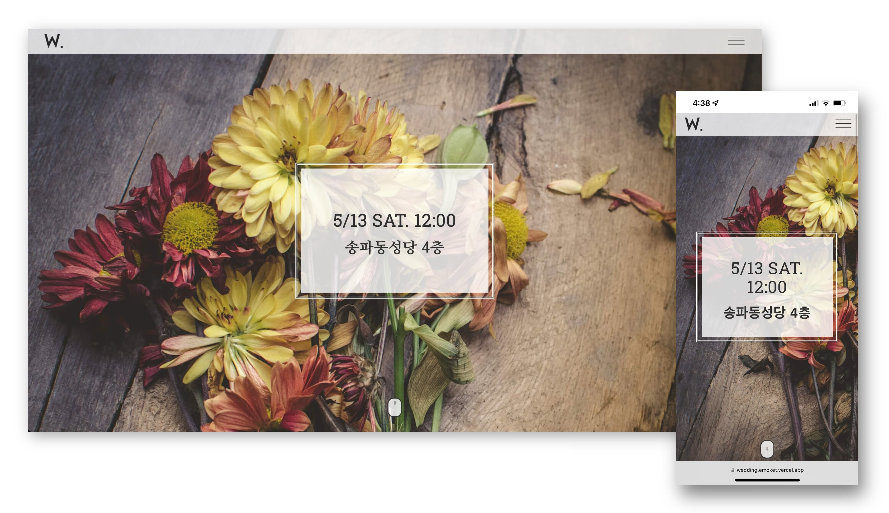

 

  

<h2 align="middle">심플 청첩장</h2>

사진만 바꿔서 바로 사용할 수 있는 심플한 스타일의 청첩장입니다.

2017년 결혼식 때 사용하려고 만들었다가 이제야 꺼내봤는데

당시의 추억이 새록새록 솟네요 🤗

누군가에겐 꼭 필요한 것일 수 있어 퍼블릭으로 변경하였습니다.

Ps. 축하해 주신 모든 분들께 다시 한 번 감사의 마음을 전합니다. 🙏🏻

 

  
  
  
  
  

 
